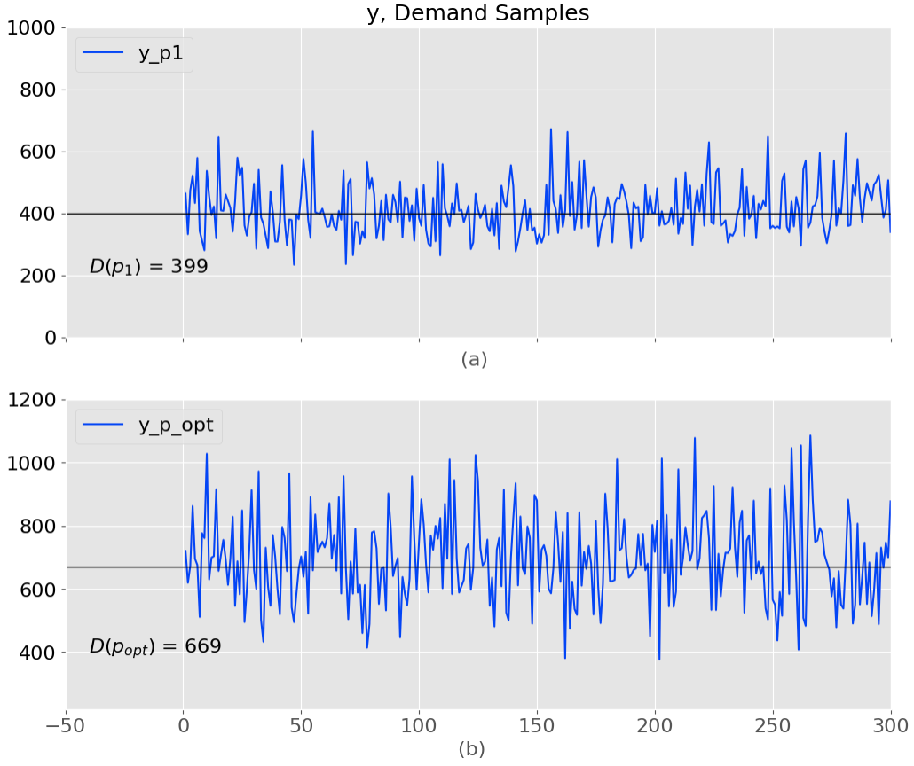
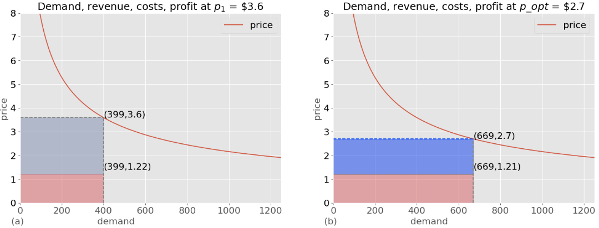
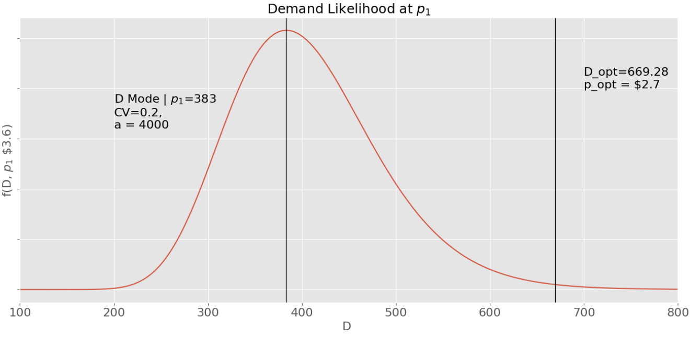
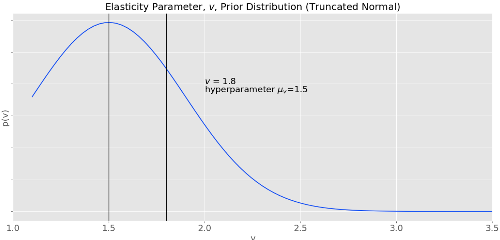
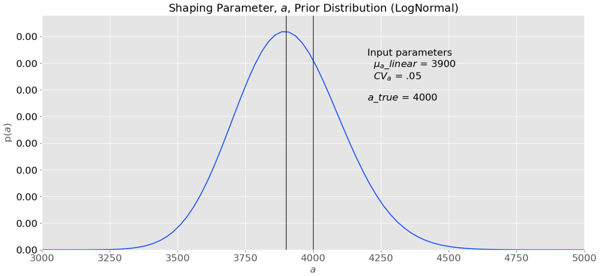
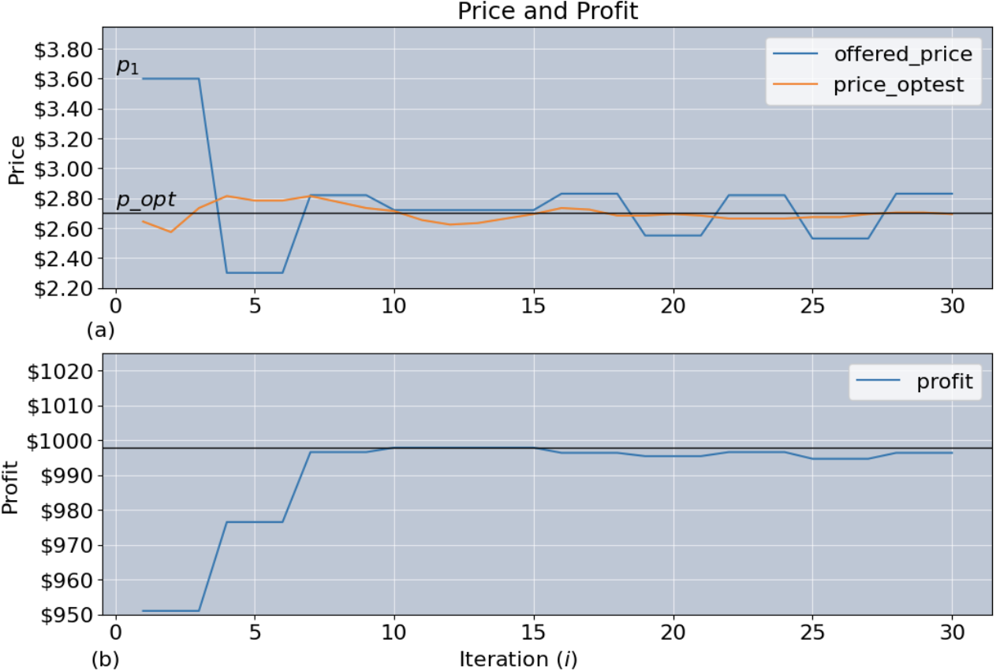
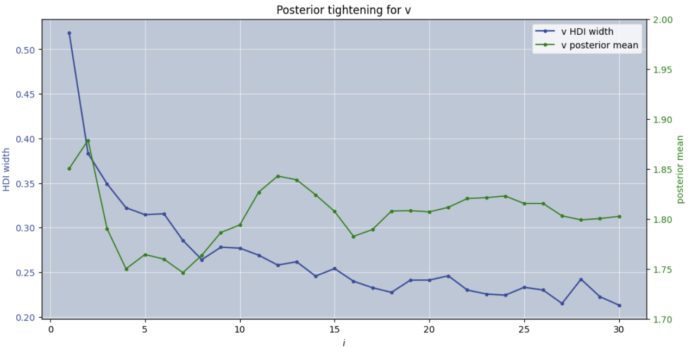
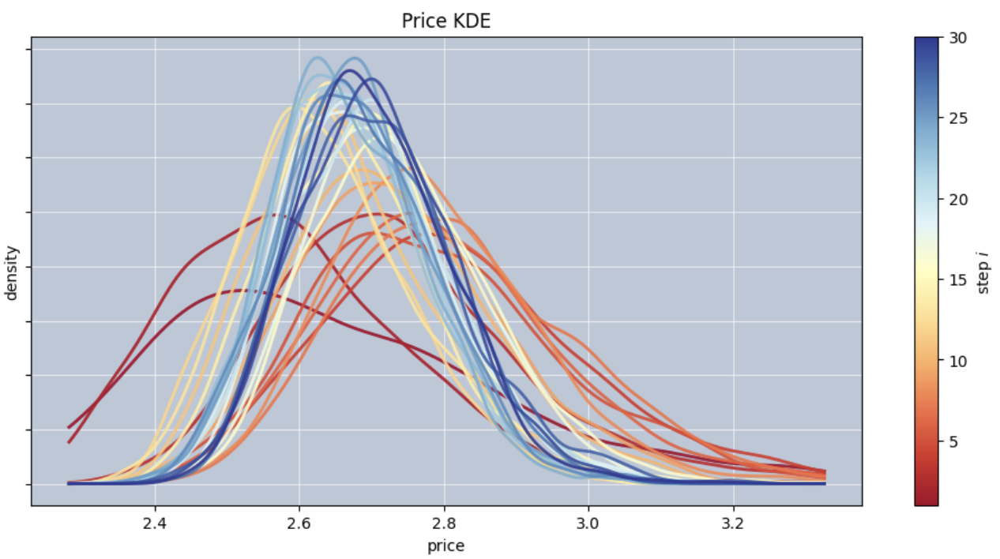
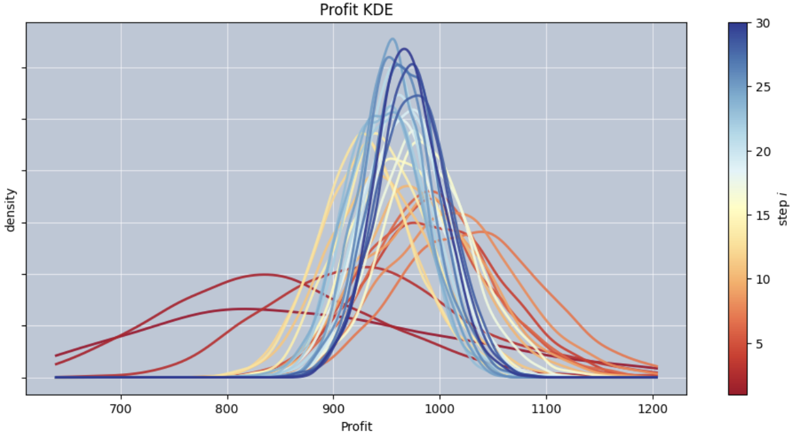

# Thompson Sampling for Dynamic Pricing - from theory to practice

by Alberto Gutierrez
algutier1@gmail.com
Pre-print, Draft
Updated: May 10, 2026
Constructive review and comments are encouraged

# 1.Introduction

Optimal pricing strategies, such as dynamic, seasonal, or peak-and-off-peak pricing, leverage algorithmic approaches to improve profitability. Even small improvements in price can have a disproportionately large impact on profits, often exceeding the effect of comparable changes in volume or cost [1]. As of 2021, approximately 21% of companies reported using dynamic pricing [2]. Historically, modern dynamic pricing was born in the airline industry, where Smith–Leimkuhler–Darrow (American Airlines) [3] reported a \$1.4 billion gain over three years in the late 1980s. Total system revenue was \$16 to \$17 billion annually, therefore lifting total revenue by approximately 3%, corresponding to roughly $500 million in annual incremental revenue.

A widely used approach for sequential price optimization is Thompson Sampling (TS) [4]. Though Thompson Sampling was first introduced in 1933, its application to pricing is relatively recent [5, 6]. A more general survey tracing the origins of dynamic pricing, including historical references dating back to the 1800s through modern developments, is provided by den Boer [7]. Phillips, *Pricing and Revenue Optimization*, provides a classic and accessible introduction to dynamic pricing and revenue management [8].

Despite the recent application of Thompson Sampling to pricing, there are relatively few examples that clearly connect TS-based pricing across statistical, econometric, and software domains. To our knowledge, this is one of the few end-to-end treatments that integrates:
&emsp;&emsp; (i) microeconomic stochastic demand modeling,
&emsp;&emsp; (ii) Bayesian inference via Thompson Sampling, and
&emsp;&emsp; (iii) a fully reproducible software implementation.

Consequently, successfully applying TS to pricing is not obvious and requires a careful formulation of statistical methods, parameters, and software to set up an efficient and accurate model. For example, current papers or blog posts often dive straight into software, mathematics, or results, glossing over details outside their respective domains. Cross-domain understanding leads to a more complete view of the problem being solved, a better solution, and corresponding insights.

To address this situation, this paper provides an introduction that bridges these domains, including identifying algorithmic challenges, practical solutions, and an accompanying implementation. Especially for experts who may not be versed in all three of these areas, the paper is intended to provide a formulation from basic principles to practical application. Along with this paper is an exemplary implementation contained in a GitHub repository, including:

* TS Dynamic Pricing Implementation (Jupyter Notebook) [9]
* TS Simulation Results Analysis (Jupyter Notebook)  [10]

In the subsequent discussion, we address the following topics.

***Microeconomic Demand Model***
Beginning with the well-known constant-elasticity demand function, a probabilistic demand model with multiplicative noise is developed. Statistical expressions for log-normal demand with multiplicative noise are listed, clearly showing the linear and log-space relationships. These equations, along with their relationship to classical demand and dynamic pricing, are difficult to find in a single place; this unified treatment across domains is a key contribution of this paper. An exemplary product or service is introduced and supports examples throughout the paper. Furthermore, these detailed demand expressions, along with expressions for price and profit, are a foundation for the dynamic pricing algorithm.

***Thompson Sampling***
Beginning with a general introduction to Thompson Sampling, a TS-based dynamic pricing model is developed, including the mathematical expression for the demand likelihood, prior probabilities, and corresponding model parameters. Visualizing the likelihood, priors, and model parameters relevant to our example provides insight into effective choices for the TS pricing model's density functions and parameters.

***Dynamic Pricing Software Model and Iteration***
Based on our Bayesian statistical model, we develop an iterative software model for TS Dynamic Pricing. In step 1, the software model is set up and initialized, and then each subsequent step includes
* price exploration: selecting a price 
* exploitation: offering the price
* model update: incorporating observed demand
* estimation: updating optimal price estimate.

***TS Iteration Results***
The iterative software model is then applied to the e-commerce/retail demand example, and we visualize the results with several graphics. The step-by-step, iterative price exploration and the optimal price estimate show the algorithm converging to the optimal price and profit. The key to achieving the optimal price is for the algorithm to estimate the true (actual) price elasticity; thus, we observe the posterior probability tightening for the elasticity by plotting the HDI (High Density Interval) at each step. Finally, to visualize convergence and the tightening of price and profit, we overlay KDE densities at each iteration.

***Summary and Conclusions***
To conclude, the insights for modeling the posterior demand statistics and creating an effective Bayesian pricing model are summarized. Key insights include estimating input parameters, improving price exploration, estimating the optimal price from posterior samples, and visualizing convergence.  

# 2. Microeconomic Demand Model
In microeconomics, the constant elasticity of demand function, $D(p)$ [8,11] yields the quantity demanded at price, $p$ and elastiticy $v$.

```math
 D(p) = a p^{-v} \tag{1}
```
as demand increases, the quantity demanded decreases. For convenience, economists typically write the constant elasticity demand function with a negative sign on the exponent. Therefore, the coefficient in the demand equation represents the absolute value (non-negative magnitude) of the elasticity.


### 2.1  Probabilistic Demand

In reality, demand is not deterministic. Typically, demand is modeled as a random variable, $D$, with multiplicative noise [12, 13]. A log-normal distribution arises naturally when variability enters a system multiplicatively, where, on a log scale, multiplicative noise becomes additive [14]. In practice, demand experiences random disturbances that act as multiplicative noise. This multiplicative noise reflects exogenous demand shocks. These unpredictable influences are traditionally called “shocks”, and in our case, “demand shocks”, arising from factors such as weather, consumer mood, competition, or news.

Mathematically, we express an observation of demand, D, as $y_i$, and thereby express the statistics of D in terms of $y_i$.

$$y_i = a p_i^{-v} e^{\varepsilon_i}, \quad \varepsilon_i \sim \mathcal{N}(0,\sigma^2)  \tag{2}$$

This defines a generative model in which demand is obtained by scaling deterministic demand with a log-normal shock. Equation 2 explicitly expresses the noise as multiplicative, representative of “demand shock”, and the exponent is zero-mean, normally distributed with standard deviation $\sigma$. These are the characteristics of a log-normal random variable.

Demand is therefore modeled as a log-normal random variable:

$$y_i\, | \,p_i \sim LogNormal(\mu_L, \sigma^2),  \tag{3a}$$

where $\mu_L = \ln(\mu) = \ln(a p^{-v}) = \ln(a) - v  \ln(p_i)$.


For a log-normal distribution, the median is $e^{\mu_L}$, which corresponds to $\mu = a p^{-v}$, and

 $$p(y_i | a,v,\sigma, p_i) = \frac{ 1}{y_i\sigma\sqrt{2 \pi} } exp(-\frac {(\ln  y_i - \mu_L)^2}{2  \sigma^2}),  \ y_i > 0  \tag{3b} $$


These expressions represent the probability density of demand $D$, or equivalently, an observation $y_i$ (a realization of $D$); we also use y to denote a generic observation. The conditional parameters are denoted by $\theta = (a,v, \sigma )$. 


It is important to distinguish between the linear-space parameter $\mu = ap^{-v}$, Eq. (1), and its log-space counterpart $\mu_L = \ln(\mu)$. In practice, demand is observed, and decisions are made in linear space, where $\mu$ corresponds to the median demand. However, estimation and inference are performed in log-space, where the model becomes linear with additive Gaussian noise. This distinction is particularly relevant for algorithmic implementations, where parameter updates occur in log-space while predictions and decisions are evaluated in linear space.

For convenience, we express expectations for $D$ (linear-space) or $\ln D$  (log-space), which we will refer to throughout the paper.

 $$\mathbb{E}[\ln D] = \mu_L =  \ln a - v \ln\, p  \tag{4a} $$


$$\mathrm{SD}[\ln D] = \sigma \tag{4b} $$

$$\text{Mode} \ D  = a p^{-v} e^{-\sigma^2} = \mu e^{-\sigma ^2} \text{(peak of density)} \tag{4c}$$

$$\text{Median}\ D = a p^{-v}  = \mu \tag{4d}$$


$$\text{Mean}\ D  = \mathbb{E}[D] = e^{\mu_L + \frac{ \sigma^2}{2}} = a p^{-v} e^{\frac{{\sigma^2}}{2}} = \mu e^{\frac{{\sigma^2}}{2}} \tag{4e}$$

$$\mathrm{SD}[D]  = \mu  e^{\sigma^2/2} \sqrt{e^{\sigma^2}-1} \tag{4f}$$


$$\text{Demand Coefficient of Variation},CV_d = \frac {SD[D]} {\mathbb{E}[D]} = \sqrt{e^{\sigma^2} - 1}  \tag{4g} $$

We observe that the log-normal density $p(D)$ is skewed to the right and that $Mode < Median < Mean$. Due to log-normality, the expected demand exceeds the median: $\mathbb{E}[D] = \mu e^{\sigma^2/2} >  \mu$. That is, the mean is shifted to the right by the multiplicative noise and the median aligns with the deterministic demand, Eq. (1). This distinction is important for pricing decisions, where expected revenue depends on $\mathbb{E}[D]$, not the median.


Regression models of demand typically transform demand to log-scale, with the transform $\ln D = \ln(D)$, where $\ln D$ is normally distributed with an additive noise term. Log-log regression is applied, and predictions in log-space, $\ln \hat{D}$, are transformed back to a linear scale with the exponential transform $e^{\ln \hat{D}}$, which corresponds to the median in linear space, while the expected (mean) demand is $e^{\hat{\mu}_L + \sigma^2/2}$ [15, 16].

The log-space Demand is given by

$$\ln y \sim \mathcal{N}(\mu_L, \sigma^2) \tag{5} $$


and the Normal density function corresponding to the log demand is

$$p(\ln y \mid \theta, p) = \frac{1}{\sigma \sqrt{2 \pi}} \exp(-\frac{(\ln y - \mu_L )^2}{2\sigma^2}) \tag{6}$$

Note that the log-normal density Eq. (3) and the normal density Eq. (6) are both functions of $\ln y$. This dependency arises because, typically, a log-normal random variable is formulated in log-space, as in Eq. (5). Transformation to linear-space $D = e^{\ln D}$, is a change of variable resulting in the term $\ln y$ in the exponent, and the factor $1/y$ in the denominator, Eq. (3b).

### 2.2 E-commerce/Retail Demand Example

As a running example throughout this paper, we assume a demand elasticity parameter of $v = 1.8$, consistent with empirical estimates for discretionary e-commerce categories and digital goods. For such goods, observed price elasticities typically range from −1.2 to −1.7 (with $v$ denoting the absolute value), with higher sensitivities in highly substitutable and promotion-driven markets [17–21].


&emsp;&emsp;  $a = 4000$, demand shaping parameter
&emsp;&emsp;  $v = 1.8$, demand elasticity
&emsp;&emsp; $CV_d = 0.2$

We further assume a coefficient of variation $CV_d$ = 0.2, corresponding to a moderate and fairly stable demand (i.e., a 20% standard deviation relative to mean demand), which is common for mature retail categories and recurring services.


  

&emsp;&emsp; Figure 1.Each plot shows demand samples over 300 periods ($a = 4000$, $v = 1.8$, $CV_d = 0.2$) at two price levels: (a) $p_1 = \$3.6$ and (b) $p_{\text{opt}} = \$2.7$. 


The demand at two price levels is illustrated in Figure 1, a and b, contrasting the initial offered price, $p_1$= \$3.6 vs the optimum price \$2.7 (see next section). On each graph, the deterministic demand ($a p ^ {-v}$) is indicated by the horizontal black line, which corresponds to the median of the demand distribution.

As indicated by Eq. (4e), the mean of our demand is a function of the offered price, $p$. In Figure 1a, the mean demand at the price \$3.6 is 399, which is significantly below $D_\text{opt}$ = 669, and at $p_\text{opt}$ (Fig. 1b). At $p_{\text{opt}}$, the variability increases and the distribution is right-skewed, with the mean exceeding $D_{\text{opt}}$ due to the log-normal shift, Eq. (4e). Although deterministic demand $a p^{-v}$ decreases with price, the expected demand $\mathbb{E}[D]$ is systematically higher due to multiplicative noise.

### 2.3 Demand, Price, and Profit

The objective of the dynamic pricing algorithm is to find the price that optimizes profit. Therefore, it is necessary to understand the precise relationship between price and profit. The derivation of the price for optimal profit can be found in microeconomic textbooks, such as [11]. Here, we assume that the cost of production is governed by fixed cost, $F$ (\$6), and variable unit cost, $c$ (cost per unit, \$1.2). Furthermore, we assume a monopolistic pricing situation, the typical assumption for this analysis. That is, competitors or substitute goods do not affect demand, and thus the firm offering the product can follow its own demand curve, unperturbed by competitors' responses to its price variations. The TS Algorithm is resilient to inaccuracies in this assumption, as the data gathered at each price point includes competitor responses and potential product substitutions.

We express the profit as the revenue minus the cost, with and without noise.
&emsp;&emsp; Profit = Revenue - Variable\, Costs - Fixed Costs, and
$$
\begin{aligned}
\text{Revenue (median)} &= p \cdot D(p) \\
\text{Revenue (mean)} &= p \cdot D(p) e^{\sigma^2/2} \\
\text{Variable Costs (median)} &= c \cdot D(p) \\
\text{Variable Costs (mean)} &= c \cdot D(p) e^{\sigma^2/2} \\
\text{Fixed Costs} &= F
\end{aligned}
$$
Under stochastic demand, the median profit is

$$\text{Median} \ Profit(p)  = (p - c) D(p) - F   \tag{7a} $$

This is equivalent to the classic profit equation (deterministic demand, Eq. (1)). However, we see that the expected profit is increased due to the multiplicative lognormal factor [14, 15], $e^{\sigma^2/2}$, and is independent of price.

$$\text{Mean} \ Profit(p)  = (p - c) D(p)e^{\sigma^2/2} - F   \tag{7b} $$

Under lognormal demand, multiplicative noise increases expected demand due to the distribution’s right skewness, and, correspondingly, the expected mean revenue and profit also increase. The multiplicative demand shocks, $e^{\varepsilon_i}$ (Eq. (2)), are strictly positive but can be less than one, resulting in bounded downside and unbounded upside, which ultimately pulls the mean upward. This reflects an increase in expected revenue and profit rather than a redistribution of a fixed demand level.

Since the lognormal mean differs from the median by a multiplicative constant independent of price, the profit-maximizing price is identical under both formulations. Starting with Eq. 7a or 7b, differentiating with respect to price and solving for the optimal price, we obtain

$$p^* = \dfrac{v}{v -1} c\, \tag{8}$$

For our running example, with the help of Eqs. (1), (7a), (7b), and (8), we calculate the optimum price, demand, and profit:

&emsp;&emsp; $Price_\text{opt} = p^* \approx \$2.7$ 

The median demand and profit are
&emsp;&emsp; $D_\text{opt} \  \text{median} \approx 669 $
&emsp;&emsp; $Profit_\text{opt} \ \text{median} \approx  \$998 $

The mean demand and profit are
&emsp;&emsp; $D_\text{opt} \  \text{mean} \approx 683 $
&emsp;&emsp; $Profit_\text{opt} \ \text{mean} \approx  \$1018 $

Figure 2 presents classic illustrations of demand (median), revenue, costs, and profit. The initial offered price is $p_1 = \$3.6$, and the profit is represented by the area of the shaded region (Figure 2a), $\$399 \times (3.6 - 1.22) \approx \$950$. Here, \$1.22 represents the average cost per unit, which includes both variable cost and fixed cost amortized over demand, i.e., $c + F/D$.

At the optimal price $p_{\text{opt}} = \$2.7$ (Eq. 8), the higher demand reduces the fixed cost per unit (i.e., $F/D$), resulting in an average cost of approximately \$1.21. The corresponding profit is $669 \times (2.7 - 1.21) \approx \$997$, Eq. (7).




&emsp;&emsp; Figure 2. (a) Median demand vs. price, showing revenue, cost, and profit at $p_1$ = \$3.6 and (b)  $p_\text{opt}$ = \$2.7.


Thus, the objective of the TS Dynamic Pricing algorithm is to learn this optimal price through sequential observations of demand, that is, to move from the initial price toward the optimum price. In our running example, this corresponds to median profit \$950 at the initial offered price of $p_1$ = \$3.6 to a median profit of \$998 (mean profit \$1018) at the offered price of $p_\text{opt}$ = \$2.7.

# 3. Thompson Sampling

### 3.1 Introduction to Thompson Sampling
Before describing TS applied to dynamic pricing, we briefly review Thompson Sampling and some use cases where it is applied.

The TS method solves the so-called "multi-armed bandit" problem.  This terminology originates from a scenario [23] in which a gambler sits down at a slot machine with multiple levers (i.e., arms). When pulled, an arm produces a random payout. Because the distribution (i.e., probability) of payouts corresponding to each arm is unknown, the player can learn this distribution only by experimenting. As the gambler learns about the arms’ payouts, she faces a dilemma: in the immediate future, she expects to earn more by exploiting arms that have yielded high historical payouts, but by continuing to explore alternative arms, she may learn how to earn higher payouts in the future. 

For the ensuing discussion, it is helpful to recall Bayes theorem and the corresponding terminology.

&emsp;&emsp; $P(A\ |\ B) = \dfrac{P(B\ |\ A)P(A)}{P(B)}  = \dfrac{Likelihood \cdot Prior}{Evidence}$  &emsp;&emsp;&emsp;&emsp;&emsp;&emsp;&emsp;&emsp;&emsp;&emsp;&emsp;&emsp; &emsp;&emsp;&emsp;&emsp;&emsp; (9)

TS is a Bayesian algorithm; that is, it applies Bayes' rule to update the posterior probability distribution, which is decomposed (by Bayes' rule) into the corresponding likelihood and prior probabilities. On the right side of the expression, the posterior distribution is expressed in terms of likelihood, prior, and evidence.  

Typical use cases in which Thompson Sampling provides a solution include A/B testing and Recommendation Systems.

* TS enables dynamic traffic allocation to the different groups based on Bayesian probabilities. For example, the audience is divided into two groups (A and B), each exposed to different variants of the product or website

* In recommendation systems, TS is applied to explore and exploit user preferences efficiently. These systems aim to present personalized content or items to users based on their historical interactions or preferences. 

TS implements the exploration–exploitation tradeoff using a Bayesian approach. At each step, it samples model parameters from the posterior distribution and selects the action that is optimal under the sampled parameters ("exploitation"). To learn the underlying statistics, TS explores the parameter space through posterior sampling while simultaneously exploiting current estimates. As the posterior distribution tightens, samples concentrate around the true parameter values, leading to more consistent selection of optimal actions.

When applied to dynamic pricing, an attractive feature of the TS algorithm is its price exploration, which provides a systematic approach to pricing and converges to the price that maximizes expected profit.

### 3.2 TS Dynamic Pricing Model


#### 3.2.1 Statistical Model

We formulate our Bayesian model based on the demand posterior, $p(\theta \mid \mathbf{D})$. The demand, $\mathbf{D}$ is written in bold font because within the context of our TS algorithm, it represents a set of demands, $\mathbf{D} = ( y_i,...,y_n )$, that is, a demand measurement, $y_i$, at each step of the iterative process. Furthermore, the TS algorithm is formulated to discover the demand parameters $a$ and $v$ in the deterministic demand model, Eq. (1). Applying Bayes rule, and accounting for the iterative price and demand observations, we obtain an expression for the posterior distribution.


$$p(\theta \mid \mathbf{D}) \propto \biggl( \displaystyle\prod_i^np(y_i \mid \theta,p_i)\biggr) \, p(a) \, p(v),\quad \mathbf{D} = ( y_i,\dots,y_n ) \tag{10}$$

where $p(y_i \mid \theta, p_i)$ is the log-normal likelihood defined in Eq. (3b), and observations are assumed conditionally independent given $\theta$. The posterior is proportional to the product of likelihood terms multiplied by the prior distributions $p(a)$ and $p(v)$, where $\theta = (a, v)$ denotes the parameters to be learned, and $\sigma$ is treated as fixed. In our TS algorithm design, the variance of demand $\sigma$ is estimated prior to applying the algorithm and used as a fixed input parameter. The price $p_i$ at each step is the exploration price selected by the TS algorithm.

A closed-form expression for the posterior is not analytically tractable, therefore, equation 10 is implemented with the help of a probabilistic programming language (PPL) supporting Bayesian statistical inference and optimization, such as Stan [23] or PyMC [24]. 


The TS dynamic pricing model iteration, each step $i$, includes the following actions and corresponding algorithm behavior.

* Exploration

  * At each step, TS samples parameters $\theta = (a, v)$ from the posterior distribution and selects the price that maximizes the profit function, Eq. (7) according to the sampled parameters.  

  * Our implementation introduces additional exploration heuristics to improve convergence.

  * As the posterior concentrates, samples increasingly concentrate around high-probability parameter values.

* Exploitation

  * At each step, the selected price is offered to the market, and the market response (demand) is measured.

  * In practice, the observed demand is the measured market response. However, in our TS Iteration example (below), the observed demand is simulated by sampling from the generative model in Eq. (2).

* Update posterior

  * Updating the posterior corresponds to conditioning Eq. (10) on the new observation with the data at step $i$, $(p_i, y_i)$, that is, the posterior is updated by conditioning on the new observation $(p_i, y_i)$, refining the parameter estimates to better fit the observed data.
  * As the posterior distribution tightens, the density function (Figure 3) will shift towards the optimal demand and with increasing concentration around the optimal parameter values.

This iterative process balances exploration and exploitation, enabling convergence to the price that maximizes expected profit.

#### 3.2.1 TS Model Input Parameters

Before a detailed discussion of each term in Eq. (10), it is useful to summarize the model’s input parameters. For convenience, all input parameters and their relationships to the model variables (Eqs. (10)–(13)) are listed in Table 1. The details of the corresponding prior probability density functions and parameters are discussed in the following subsections. These priors encode initial beliefs about the demand parameters before observing data. The parameter values are chosen to align with the demand example in Section 2.2.

| Model Variable | Prior Distribution / Function | Input Parameters | Description |
| :-------- |--------- |------- |:------|
| $a$ | Log-normal | $\mu_{a,\text{linear}} = 3900$, $CV_a = 0.05$ | Shaping parameter $a$ is modeled with a log-normal prior, parameterized by its mean in linear space and coefficient of variation. |
| $v$ | Truncated normal | $m_v = 1.5$, $\sigma_v = 0.4$, lower bound = 1.1 | Demand elasticity $v$ is modeled with a truncated normal distribution with mean $m_v$, standard deviation $\sigma_v$, and lower bound 1.1. |
| $\sigma$ | Fixed | $CV_d = 0.18$ | Demand variance $\sigma$ is treated as a fixed parameter, specified via the coefficient of variation of demand, $CV_d$. |
| $p_i$ | $[p_{\min}, p_{\max}]$ | $[\$2, \$4]$ | The minimum and maximum prices define the allowable range for price exploration. |

&emsp;&emsp; Table 1. Model input parameters and values


#### 3.2.2 Demand Likelihood

The demand likelihood is the product of log-normal probabilities corresponding to all data points $\{(p_i,y_i)\}_{i=1}^n$, where $n$ corresponds to the current step. 

The likelihood for a single observation is given by

$$p(y_i \mid \theta, p_i) = \frac{1}{y_i\,\sigma\sqrt{2\pi}} \exp\left(-\frac{(\ln y_i - \ln \mu_i)^2}{2\sigma^2}\right),
\quad \mu_i = a p_i^{-v}
\tag{11a}$$

and the full likelihood is then the product over all observations,
$$
\prod_{i=1}^n p(y_i \mid \theta, p_i) \tag{11b}
$$

The likelihood for $i = 1$ is graphed in Figure 3, where $p_1$ = \$3.6. We observe that the likelihood is right-skewed, Eq. (4e), so the the peak corresponds to the mode, $D_{\text{mode}} \mid p_1 = 383$, Eq. (4c). Also shown on the graph is the optimum (median) demand, $D_\text{opt} = 669$, at price $p_\text{opt} = \$2.7$. The figure illustrates the initial likelihood corresponding to the first observation. As additional data are observed, the posterior distribution over the parameters shifts and concentrates, leading to improved estimates of the optimal demand $D_{\text{opt}}$.

  

&emsp;&emsp; Figure 3. Demand likelihood at price $p_1 = \$3.6$, with $a_{\text{true}} = 4000$ and $CV_d = 0.18$.

The parameters corresponding to Eq. (11) are listed in Table 1. The demand noise $\sigma$ is derived from the coefficient of variation input $CV_d = 0.18$, according to Eq. (4g). In contrast, the true coefficient of variation used in the data-generating process (TS Interation example, below) is $CV_{d,\text{true}} = 0.2$. Since $CV_{d,\text{true}}$ is unknown to the algorithm, the model uses a fixed estimate $CV_d$ as an input parameter.

#### 3.2.3 Elasticity of Demand, Prior $v$

The probability density $p(v)$ represents our understanding of the elasticity before applying the pricing model. In early iterations, when data are limited, the posterior is strongly influenced by the prior. The elasticity of demand in our example case is elastic ($v>1$), meaning that demand is price-elastic, decreasing as price increases. Furthermore, the optimal price, Eq. (8), has a singularity at $v=1$ (unit elasticity). Gelman et al. (Bayesian Data Analysis [25]) recommend constrained truncated priors when parameters are only meaningful on restricted domains and when unconstrained priors induce pathological behavior. Therefore, we restrict the support of v by modeling the prior, $p(v)$, as a truncated normal distribution, with a lower limit of $v_{min} = 1.1$. This constraint ensures economically meaningful elasticity values and avoids unstable pricing behavior near $v=1$.

The truncated-normal density is given by

$$p(v) =  \frac{1}{C \, \sigma_v \sqrt{2 \pi}}\exp(-\frac{(v-\mu_v)^2}{2\sigma_v^2}), \quad v > v_{\min} \tag{12a}$$

where C is the normalizing constant, equal to the survival function of a standard normal distribution:  
$$
C = 1 - \Phi\!\left(\frac{v_{\min} - \mu_v}{\sigma_v}\right) \tag{12b}
$$

Figure 4 illustrates the truncated normal prior density $p(v)$, with parameters corresponding to our example case (Table 1). The true elasticity $v = 1.8$ is not known to the algorithm. Therefore, before applying the algorithm, an initial prior over $v$ is specified, and is comprised of parameters $\mu_v$ = 1.5 and $\sigma_v$ = 0.4, with lower limit $v_{min}$ = 1.1.

   

&emsp;&emsp; Figure 4. Prior distribution of elasticity v (truncated normal) with input parameters..


#### 3.2.4 Shaping Parameter Prior, $a$

The probability density $p(a)$ represents our understanding of $a$ before applying the pricing model. The demand multiplicative constant $a$ is strictly positive, and therefore the recommended prior model is log-normal [27].

$$
p(a) = \frac{1}{a\sqrt{2\pi}\sigma_a} \exp\left(-\frac{(\ln a - \mu_a)^2}{2\sigma_a^2}\right)
\tag{13a}
$$

$$
a \sim \text{LogNormal}(\mu_a, \sigma_a^2)
\tag{13b}
$$

$$
\ln a \sim \mathcal{N}(\mu_a, \sigma_a^2)
\tag{13c}
$$

Equations (13b) and (13c) clarify that the log-normal prior is parameterized in log space.

This prior influences early posterior samples and therefore the initial price exploration in Thompson Sampling. Before applying the model, an initial prior over $a$ is specified based on parameter estimation, with parameters $\mu_{a,\text{linear}} = 3900$ and $CV_a = 0.05$.

Accurate convergence in the dynamic pricing model depends on a well-specified initial prior for $a$. In particular, priors centered near the true value with moderate variance lead to improved posterior parameter estimation. This highlights the importance of specifying an accurate initial prior over $a$, including the linear mean $\mu_{a,\text{linear}}$ and $CV_a$. It is observed empirically that a wider initial prior over $a$ (larger $CV_a$) increases uncertainty in the demand uncertainty (i.e., in the demand scale), which can propagate to the estimation of $v$, leading to less accurate estimates of the optimal price.

The prior probability density $p(a)$ and input parameters are visualized in Figure 5.



&emsp;&emsp; Figure 5. Shaping parameter $a$, log-normal prior distribution and input parameters.

By convention, the log-normal parameters $\mu_a$ and $\sigma_a$ denote the mean and standard deviation in log space. The linear-space mean is given by $\mu_{a,\text{linear}} = \mathbb{E}[a]$, and the median of the distribution is $e^{\mu_a}$. The parameters $\mu_{a,\text{linear}}$ and $\sigma_{a,\text{linear}}$ are estimated from demand observations prior to applying the pricing algorithm. The corresponding log-space parameters are obtained via the following transformations:

$$
\mu_{a,\text{linear}} = \mathbb{E}[a] = e^{\mu_a + \sigma_a^2/2}
\tag{14a}
$$

$$
\sigma_a = \sqrt{\ln(1 + CV_a^2)}
\tag{14b}
$$

$$
CV_a = \frac{\sigma_{a,\text{linear}}}{\mu_{a,\text{linear}}}
\tag{14c}
$$

$$
\mu_a = \ln(\mu_{a,\text{linear}}) - \sigma_a^2 / 2 
\tag{14d}
$$


The subtraction term in Eq. (14d), $-\sigma_a^2/2$, arises because the prior is parameterized in terms of the linear-space mean $\mu_{a,\text{linear}} = \mathbb{E}[a]$. For a log-normal distribution, the mean satisfies $\mathbb{E}[a] = e^{\mu_a + \sigma_a^2/2}$, so the term $\sigma_a^2/2$ must be subtracted to obtain the log-space mean $\mu_a$. In contrast, in Eq. (3b), $\mu_L = \ln(\mu)$ corresponds to the log of the median (deterministic demand) rather than the mean, and therefore no such adjustment is required.

#### 3.2.5 Demand Spread, $\sigma$


The demand noise $\sigma$ is a parameter in the demand likelihood, Eqs. (10, 11). Before applying the pricing model, it is necessary to estimate the demand noise as in Eq. (4g), where $\sigma$ is derived from the input parameter $CV_d = 0.18$ (Table 1).

It is important to note that $\sigma$ could be included in Eq. (10) as an additional parameter with an associated prior. However, in our experiments, doing so increases uncertainty in the demand level, leading to less accurate estimates of the optimal price. Thus, it was found more effective to estimate $CV_d$ and compute $\sigma$ accordingly. 


A natural question is why the parameter $a$ is not fixed, as is done here with $\sigma$. In contrast, fixing the demand scaling parameter $a$ would introduce a systematic bias in the model. Because $a$ directly determines the level of the demand function, an incorrect fixed value shifts the expected demand and forces compensation through the elasticity parameter $v$, leading to biased estimates of $v$ and the optimal price.

By comparison, $\sigma$ governs the spread of demand and does not introduce systematic bias in the mean demand. As a result, fixing $\sigma$ primarily affects statistical uncertainty rather than inducing systematic error, leading to a comparatively minor impact on the estimated optimal price.


# 4. TS Iteration

We now describe the iterative application of the pricing model, including:

1. Model setup and initialization  
2. Estimation of the global optimal price  
3. Iterative exploration, exploitation, and posterior update   


### 4.1 Step 1: Model Setup and Initialization

In this step, the statistical pricing model, Eqs. (10)–(13), is set up, including the input parameters, and initialized with the first data point $(p_1, y_1)$. The dynamic pricing model is implemented using the PyMC probabilistic programming framework [24] within a Jupyter Notebook [9]. In this work, PyMC is selected to enable seamless integration with a Python-based application stack, particularly for backend API deployment.


To illustrate the PyMC implementation, we present below the Python initialization method `init_ts_pricing_model`, an excerpt from the Jupyter Notebook [9], which directly encodes the probabilistic model defined in Section 3.2.

The goal is to provide a conceptual overview of the statistical model rather than a line-by-line explanation. The function resides within a Python class (hence the reference to `self`) and supports several options for experimentation; here, we focus on the default configuration used in this work.


```Python
   1  def init_ts_pricing_model(self, draws: int = 1000, tune: int = 2000, chains: int = 2,
                                target_accept: float = 0.99):
   2
   3     with pm.Model() as model:
   4         # ---- Prior for a (LogNormal via loga ~ Normal) ----
   5         cv2_a = (self.sigma_a_linear / self.m_a_linear) ** 2
   6         sigma_loga = np.sqrt(np.log1p(cv2_a))
   7         mu_loga = np.log(self.m_a_linear) - 0.5 * sigma_loga**2
   8
   9        # ---- Prior for v (truncated normal) ----
  10        v = pm.TruncatedNormal("v",mu=self.m_v, sigma=self.sigma_v, lower=self.lower_v )
  11
  12        # ---- a (learned or fixed) ----
  13        if self.m_a_linear_fixed is None:
  14           a = pm.LogNormal("a", mu=mu_loga, sigma=sigma_loga)         
  15        else:
  16           a = pm.Deterministic( "a", 0 * v + self.m_a_linear_fixed)
  17        loga = pm.Deterministic("loga", pm.math.log(a))
  18
  19        # ---- sigma_log (log-space noise, learned or fixed) ----
  20        if self.sigma_log_fixed is None:
  21            sigma_log_scale = np.sqrt(np.log1p(self.CV_d**2))
  22            sigma_log = pm.HalfNormal("sigma_log", sigma=sigma_log_scale )
  23        else:
  24            sigma_log = pm.Deterministic( "sigma_log",  0 * v + self.sigma_log_fixed )
  25
  26        # cv useful when sigma_log not constant
  27        cv = pm.Deterministic( "cv",   pm.math.sqrt(pm.math.exp(sigma_log**2) - 1))
  28
  29        # ---- Mutable data containers, numpy arrays ----
  30        self.p_data = pm.Data("p_data", np.array([self.p0], dtype=np.float64))
  31        self.y_data = pm.Data("y_data", np.array([self.y0], dtype=np.float64))
  32
  33        # ---- Log-space likelihood (multiplicative noise) ----
  34        mu_log = loga - v * pm.math.log(self.p_data)
  35        pm.LogNormal("D_obs", mu=mu_log, sigma=sigma_log, observed=self.y_data)
  36
  37        self.model = model
  38
  39        self.trace = pm.sample( draws=draws, tune=tune, chains=chains, 
                target_accept=target_accept, random_seed=self.random_seed,  progressbar=self.verbose  )
  40
  41    return self.trace
```

* Line 10 defines the elasticity parameter $v$ using a truncated normal prior, corresponding to Eq. (12) (Figure 4).

* Line 14 defines the prior for $a$ as a log-normal distribution, corresponding to Eq. (13) (Figure 5). For evaluation purposes, the model also supports fixing $a$ to a constant value (lines 13–17), which is useful for debugging; however, as discussed previously, the prior formulation is used in this work. Line 17 computes $\log a$ (base $e$).


* Lines 21–22 define the log space demand noise parameter $\sigma$ based on the input $CV_d$. In the TS iteration, we use a fixed $CV_d$ input. For experimentation, lines 23–24 also allow $\sigma$ to be learned via a prior.

* Lines 30–31 define mutable data containers for price and demand observations.

* Line 35 specifies the demand likelihood as a log-normal distribution, with inputs including the log-scale mean, standard deviation, and observed price and demand data. This corresponds directly to Eq. (3b).

* After defining the model, line 39 runs posterior sampling using PyMC. With the default parameters (line 1), the sampler performs a tuning phase of 2,000 warm-up steps, followed by 1,000 posterior samples per chain across two chains,  yielding 2,000 posterior draws (1,000 per chain). During tuning, PyMC adapts internal sampling parameters (e.g., step size and mass matrix) to improve sampling efficiency. The resulting draws approximate the posterior distribution defined by the likelihood, priors, and observed data [23, 24].

#### 4.2 Global Optimum Price Estimate

At each step, starting with step 1, the global optimum price $p_{\text{optest},i}$ is estimated. This estimate differs from the offered price. The latter is based on a limited number of samples (draws) from the posterior distribution (next section). The optimum price estimate at each step of the algorithm is the price that maximizes expected profit obtained by averaging over the entire set of posterior draws. In mathematical terms, $p_{\text{optest},i}$ is calculated as follows.

Create a price grid 
$$
P_g = \{p_j\}_{j=1}^{N_p}, \quad p_j \in [p_{\min}, p_{\max}]
\tag{15a}
$$

For example, $N_p = 200$, where $p_{\min}$ and $p_{\max}$ are listed in Table 1. 

Select the set of $S$ posterior draws 
$$
\{a^{(s)}, v^{(s)}\}_{s=1}^{S}
\tag{15b}
$$

$S$ is the number of draws, where in our case $S = 2000$ (2 chains, 1000 draws per chain). Calculate the expected profit for each price $p_j$ using median demand:
$$
\mathbb{E}[Profit(p_j)] = \frac{1}{S} \sum_{s=1}^{S} \left[(p_j - c)\, a^{(s)} p_j^{-v^{(s)}} - F \right]
\tag{15c}
$$

Since mean demand differs from median demand by a multiplicative constant independent of price (see Section 2.3), the optimal price is unchanged whether based on mean or median demand.

The optimum price point corresponds to the maximum expected profit:
$$
p_{\text{optest},i} = \arg\max_{p_j \in P_g} \mathbb{E}[Profit(p_j)]
\tag{15d}
$$


### 4.3 Steps 2 ... N

After initialization, each iteration executes the following steps:

* Exploration
* Exploitation
* Posterior Update
* Global Optimum Price Estimate

As the algorithm advances, at each step, the posterior parameters are sampled, a new offered price is calculated, the product/service is offered to the market, the market demand response is measured, and the posterior model is updated to include the new market data. 


#### 4.3.1 Exploration

Exploration is especially important because it generates new offered prices, and together with exploitation, the model learns the demand statistics. For successful convergence, exploration needs to consistently explore optimal price areas. Below, we discuss several enhancements to the exploration for encouraging the model to explore price areas consistent with the optimum price. Together, these mechanisms balance exploration and exploitation by combining posterior sampling, variance reduction, and controlled local search around the current optimal price estimate.


***Global price limits***

All offered prices are restricted, clipped, to the global region $[p_{min}, p_{max}]$. This defines the global exploration range, effectively placing guard rails over the overall set of offered prices. In our case we set the global price range to $p_{min}$ = \$2.00 on the low end and $p_{max}$ = \$4.00 on the high end.

***Fixed Initial Prices***
To ensure the model is exposed to the range of candidate prices, it is helpful to seed the initial exploration with fixed price points. This is to ensure the algorithm sees the entire range before the posterior begins to tighten, otherwise the algorithm is subject to grow locally confident which hinders effective price exploration.


***K Posterior Samples***
TS sampling, by default, typically entails sampling the posterior parameters, one sample, $K$=1. For our pricing use case, the process of computing a new offered price, begins by sampling the posterior parameters,  $(a^{(s)},v^{(s)})$ followed by computation of the optimum profit, as a function of $K$ parameter samples. Using $K$ > 1 posterior samples reduces variance in the price estimate by averaging over multiple parameter draws, thereby dampening exploration and stabilizing price updates. This can be useful during early iterations, when the posterior probability is wide, as is illustrated in Figures 7 and 8.


Calculating the new offered price is similar to estimating the global optimum price (discussed above), however the calculation is based on  $K$ posterior samples in the Local_Price_Region. The offered price, at step $i$, is calculated as follows. Randomly select $K$ draws, and then find the price that optimizes profit.  

Create a local price grid 

$$P_{lg} = \{p_j\}_{j=1}^{L}, \quad p_j \in [p_{\text{local min}}, p_{\text{local max}}] \tag{16a}$$

for example $L = 200$.

Randomly select $K$ posterior samples (draws), 

$$ \{(a^{(k)}, v^{(k)})\}_{k=1}^{K}\tag{16b}$$

Compute the expected profit at each grid point $p_j$, based on the median profit formulation (Eq. (7a)).

$$\mathbb{E}[Profit_K(p_j)] = \frac{1}{K} \sum_{k=1}^{K} \left[(p_j - c)\, a^{(k)} p_j^{-v^{(k)}} - F \right] \tag{16c} $$

The new offered price, $p^*_i$ , is the price that maximizes expected profit:

$$ p_i^* = \arg\max_{p_j \in P_{lg}} \mathbb{E}[Profit_K(p_j)] \tag{16d}$$


***Local Price Anchor***
Observing the price posterior probability, as displayed in Figure 7 (below), illustrates that the KDE distribution is right-skewed. Particularly after some number of iterations, sampling the posterior can lead to an upward drift in the offered prices and thereby can cause the posterior probability to drift away from the optimum price. 

The remedy is to anchor exploration around the current optimal price estimate. After a number of initial sampled price explorations, compute the new offered price based on a price anchor equal to the current price optimum estimate. Thus, this mode of exploration does not rely on new posterior samples, but instead perturbs the current optimal price estimate +/- some deviation (alternating up + and down -)

***N_price_repeat***
As the demand uncertainty increases, for example CV > 0.1, experimentation shows that it is helpful to keep the price fixed at the offered price N_repeat_price times. For example, if N_repeat_price = 3, the price is offered 3 times, and on the 4th iteration, a new price is offered, according to the exploration strategies (i.e., Fixed Initial Prices, K-th Posterior Sample, or Local Price Anchor). The objective is to obtain a clearer demand signal despite the noise. For example if CV = 0.2, then the $CV_{effective}  \approx CV/\sqrt{N\_price\_repeat}$, under the assumption of independent demand realizations.


#### 4.3.2 Exploitation
Now that a new offered price is available, it is exploited; that is, the product is offered to the market at that price. In a real-life situation, the demand is measured. In our case, we simulate the market response by sampling from a demand probability function defined by Eq. (2). For example, suppose the offered price is $p_1 = \$3.6$. Drawing once from our demand probability, we obtain a demand response of 446. Note that this is a random number; each time we draw at this price level, we will receive a different random response.

#### 4.3.3 Posterior Update

The posterior update is similar to the initialization above. After updating the data, price and demand histories, the posterior is updated. Similar to the model initialization, at each step $i$, by default, there are 2000 tuning (warm-up) steps on 2 independent chains, followed by 2000 draws (1000 per chain). 

#### 4.3.4 Global Optimum Price Estimate

At each step, $i$, the global optimum price is estimated, $p_{\text{optest},i}$ according to Eq. (15).

# 5.  Iteration Results

In this section, we use visualizations to examine the convergence behavior of the algorithm.

### 5.1 Price and Profit

Figure 6 shows the price at each iteration and illustrates the algorithm’s ability to maximize profit.  
<br>
   
&emsp;&emsp; 

&emsp;&emsp; Figure 6. TS Simulation step by step (a) offered price and price optimum estimate, (b) median profit.

Overall, the model starts with the offered price $p_1$ = \$3.6. After the first posterior update, the model forms an initial estimate of the demand parameters. The first optimal price is estimated at ~\$2.64, which is a reasonably good estimate after only one posterior update. However, each run of the algorithm will be different due to the statistical nature of the demand. Across experiments, convergence is typically achieved within a few percent of the optimal price. After the initial step, the optimal price estimate oscillates around the true optimal price and reaches a very close estimate by step 15, $p_\text{optest}$ = \$2.69. After step 15, the posterior continues to tighten, and the optimal price estimate stabilizes near the optimum.

Similarly, the profit corresponding to $p_1$ is ~\$950 and, by iteration $i$ = 15, reaches the optimum profit, ~997, after which the posterior continues to tighten and the profit remains close to its maximum value.

The graph also illustrates several enhancements to exploration discussed previously. 

* *N_price_repeat* - in this case $N\_price\_repeat$ = 3, so that the offered price is offered 3 times before a new offer. In Figure 6, each flat segment of three steps reflects the use of $N\_price\_repeat = 3$.

* *Fixed initial prices* -  the initial prices are fixed to cover the global price range, in this case [\$3.6,\$2.3]. 
  
* *K posterior samples* - After the initial price exploration phase, the offered price at each step is estimated according to Eq. (16d). In Figure 6, following presentation of the two initial prices, and accounting for price repetition, the offered price is calculated based on $K=2$ posterior samples from $i$ =7 to $i$ = 15. 

* *Local Price Anchor* - From iteration $i = 15$, the exploration strategy switches to Local Price Anchor mode, where price updates are constrained to $\pm 5\%$ around the current optimal price estimate.

This behavior illustrates the balance between exploration and exploitation: early iterations explore the price space broadly, while later iterations refine the estimate near the optimal price.

### 5.2 Posterior Tightening

The profit-maximizing price (Eq. (8)) depends on the demand elasticity $v$. Therefore, it is imperative that the posterior mean accurately represents the elasticity of demand. Posterior convergence can be assessed by tracking the posterior mean $v_{mean}$ and the HDI width computed from the samples $\{v^{(s)} \}$ at each iteration. As the algorithm converges, we expect the HDI width to decrease and the mean $v\_mean$ shift so that it is centered on the true elasticity $v = 1.8$. 

For reference, a 95% interval corresponds approximately to $\pm 2$ standard deviations under a Normal approximation. In Figure 7, the HDI width decreases to approximately 0.22 at $i = 30$ and $v_{mean} \approx 1.82$. Substituting this $v_{mean}$ into Eq. (8) yields, $p^* = $ \$2.66, which in is less than 2% error compared to the optimal price.


   
&emsp;&emsp; Figure 7. Demand elasticity, $v$, HDI tightening and mean.    
&emsp;&emsp;


### 5.3  Price and Profit KDE density over time (iteration step)
KDE (Kernel Density Estimation) plots at each iteration provide additional insight into posterior convergence and uncertainty reduction.

The KDE of the price distribution, computed from the posterior samples  $\{v^{(s)}\}$ using Eq. (8), is overlaid at each iteration in Figure 8. During the early steps (red curves), the density is broad and not centered on the optimum price. As the model advances, the distribution becomes increasingly concentrated around the optimal price.


  
&emsp;&emsp;  Figure 8. Price KDE at each step.   <br>
&emsp;  


Similarly, the median profit KDE is computed at each step using the median profit formulation, Eq. (7a). Similar to the price KDE, the profit distribution is relatively broad during the early iterations. As the model advances, the peak of the distribution shifts towards the optimum (median) profit, \$997, and becomes increasingly concentrated. 


&emsp;&emsp;  Figure 9. Profit KDE at each step. 
&emsp;&emsp;  

# Summary and Conclusions

This paper addresses the need for a cross-functional, rigorous overview of Thompson Sampling for dynamic pricing, including economic stochastic demand modeling, Bayesian inference, and software. The stochastic demand is formulated in detail and clearly shows the demand as a lognormal random variable with multiplicative noise. The resulting stochastic model and software implementation, including diagnostic visualization tools, form a framework for applying TS dynamic pricing. An open-source implementation, based on the PyMC statistical programming library including graphing functions, is available in the accompanying Git repository.

Following the development of the stochastic demand model, a key result illuminates the difference between median demand, which is equivalent to the classical (deterministic) demand, and mean (stochastic) demand. Under lognormal demand, the expected demand, including revenue and profit, exceeds its median values due to multiplicative noise. Additionally, the process of dynamic price optimization is related to the classical demand, price, and profit visualizations. Though expected demand, revenue, and profit are increased by multiplicative noise, the profit-maximizing price is invariant to the noise.

The Bayesian posterior statistical pricing model is designed to learn the parameters of our constant elasticity demand model: the multiplicative constant $a$ and the demand elasticity $v$. By considering the nature of the demand variables, the pricing model is formulated with three statistical components:

*  log-normal demand likelihood with input parameter, $\sigma$ to account for multiplicative noise.
*  log-normal prior $a$ corresponding to the demand multiplicative constant.
*  and truncated-normal prior $v$ corresponding to the demand elasticity

A primary insight for achieving accurate convergence when optimizing price is that price depends solely on the elasticity parameter $v$ (Eq. (8)). Thus, inaccuracies in $ v$'s parameter estimation directly translate into price inaccuracies. Therefore, to minimize confounding influences on $v$, this implementation requires an initial estimate of the demand noise parameter $\sigma$ (i.e., $CV_d$) and recommends a tight estimation of the prior $a$. 

The TS pricing algorithm implementation goes beyond the standard ("vanilla") application of Thompson Sampling by introducing enhancements to exploration to improve convergence. These enhancements include 

   * K-posterior sampling: reduces variance in the price estimate by averaging over multiple parameter draws to dampen exploration and stabilize price updates. This can be useful during early iterations when the posterior $v$ distribution estimate is broad.

   * Fixed initial exploration: ensures the model is initially exposed to the range of candidate prices to produce a good early posterior model.

   * Repeated prices: with higher demand noise (higher CV) price repetition helps achieve a clearer demand signal, and thus reduce effective uncertainty in the coefficient of variation, where $CV_{effective} \sim CV / \sqrt{N}$.

   * Local Price Anchor: after initial price exploration, the implied posterior price distribution can become right-skewed causing the price exploration to drift away from the profit optimizing price. The remedy is to compute the new offered price using a price anchor equal to the current optimal price estimate. 

Effective application of Thompson Sampling to dynamic pricing requires monitoring the algorithm's operation and convergence. To this end, several diagnostic tools are applied in order to visualize and understand the algorithm's convergence characteristics. These include visualizations of price and profit over time (i.e., iteration steps), showing convergence toward near-optimal values. HDI (High Density Interval) visualizations illustrate the step-by-step contraction of the posterior densities, indicating that the algorithm is learning in the early phases and progressively converging in the later phases. Here we can clearly visualize the tightening of the $v$ posterior density. KDE overlay plots visualize the evolution of the posterior densities for price and profit. Early iterations exhibit broad distributions, while later iterations become increasingly concentrated around the optimum. 

These diagnostics illustrate the enhanced exploration methods applied to a realistic demand situation to achieve early broad exploration, followed by stabilization around the optimum price, then tighter convergence. 

Overall, the TS pricing framework demonstrates how sequential Bayesian learning progressively reduces uncertainty in demand estimation and improves pricing decisions over time.

Several areas remain for further study. Optimized exploration and convergence speed remain areas for further study. Additional study of realistic demand examples and comparison to more traditional regression-based pricing algorithms will also be useful.  

# References
1. McKinsey & Company. *The power of pricing*. McKinsey Quarterly, 2003. Available: https://www.mckinsey.com/capabilities/growth-marketing-and-sales/our-insights/the-power-of-pricing

2. Statista. *Dynamic pricing usage among e-commerce companies worldwide*, reported using dynamic pricing, Available: https://www.statista.com/statistics/1174557/dynamic-pricing-ecommerce-companies-worldwide/

3. B. C. Smith, J. F. Leimkuhler, and R. M. Darrow. *Yield management at American Airlines*. Interfaces, 22(1):8–31, 1992. doi:10.1287/inte.22.1.8

4. W. R. Thompson. *On the likelihood that one unknown probability exceeds another*. Biometrika, 25(3/4):285–294, 1933. doi:10.1093/biomet/25.3-4.285

5. R. Ganti, M. Sustic, Q. Tran, and B. Seaman. *Thompson Sampling for Dynamic Pricing*. arXiv:1802.03050, 2018. Available: https://arxiv.org/abs/1802.03050

6. K. J. Ferreira, D. Simchi-Levi, and H. Wang. *Online network revenue management using Thompson Sampling*. Operations Research, 66(6):1586–1602, 2018. doi:10.1287/opre.2018.1755.

7. A. V. den Boer. *Dynamic pricing and learning: Historical origins, current research, and new directions*. Surveys in Operations Research and Management Science, 20(1):1–17, 2015.

8. R. L. Phillips. *Pricing and Revenue Optimization*. Stanford University Press, 2005.

9.  A. Gutierrez, *TS Dynamic Pricing Notebook*. accompanying implementation, see repository - https://github.com/Aljgutier/dynamic_pricing_ts/blob/main/ts_dynamic_pricing.ipynb

10. A. Gutierrez, *Simulation Analysis Notebook*. accompanying implementation, see repository - https://github.com/Aljgutier/dynamic_pricing_ts/blob/main/ts_results_analysis.ipynb

11.  H. R. Varian. *Microeconomic Analysis*, 3rd ed. W.W. Norton, 1992.

12. R. S. Pindyck and D. L. Rubinfeld. *Econometric Models and Economic Forecasts*, 4th ed. McGraw-Hill, 1998.

13. K. J. Ferreira, B. H. A. Lee, and D. Simchi-Levi. *Analytics for an online retailer: Demand forecasting and price optimization*. Manufacturing & Service Operations Management, 18(1):69–88, 2016. doi:10.1287/msom.2015.0561.

14. E. B. Aitchison and J. A. C. Brown. *The Lognormal Distribution*. Cambridge University Press, 1957.

15. W. H. Greene. *Econometric Analysis*, 8th ed. Pearson, 2018.

16. K. T. Talluri and G. J. van Ryzin. *The Theory and Practice of Revenue Management*. Springer, 2004.

17. A. H. Lubis. *Price dynamics and demand elasticity in the platform economy era: A quantitative analysis of the online retail sector*,  International Journal of Economics (IJEC) 2026.

18. T. T. Nagle, G. Müller, and G. Taylor. *The Strategy and Tactics of Pricing*, 6th ed. Routledge, 2022. (Provides practical elasticity ranges across goods and services.)

19. A. Ghose and A. Sundararajan. *Evaluating pricing strategy using e-commerce data: Evidence and estimation challenges*. Statistical Science, 2006.

20. L. Einav, C. Farronato, and J. Levin. *Peer-to-peer markets*. Annual Review of Economics, 8:615–635, 2016. (Modern empirical analysis of demand sensitivity in platform markets.)

21. J. A. Chevalier and A. Goolsbee. *Measuring prices and price competition online: Amazon vs. Barnes and Noble*. Quantitative Marketing and Economics, 1(2):203–222, 2003. (Empirical estimates of online retail demand elasticities.)

22. D. J. Russo, B. Van Roy, A. Kazerouni, I. Osband, and Z. Wen. *A tutorial on Thompson Sampling*. Foundations and Trends in Machine Learning, 11(1):1–96, 2018. doi:10.1561/2200000070. arXiv:1707.02038.

23. B. Carpenter, A. Gelman, M. D. Hoffman, D. Lee, B. Goodrich, M. Betancourt, M. Brubaker, J. Guo, P. Li, and A. Riddell. *Stan: A probabilistic programming language*. Journal of Statistical Software, 76(1):1–32, 2017. doi:10.18637/jss.v076.i01.

24. O. Abril-Pla et al. *PyMC: A modern, and comprehensive probabilistic programming framework in Python*. PeerJ Computer Science, 9:e1516, 2023. doi:10.7717/peerj-cs.1516.

25. A. Gelman et al. *Bayesian Data Analysis*, 3rd ed. CRC Press, 2013.

26. Stan Development Team. *Stan User’s Guide*. Available: https://mc-stan.org/docs/.
